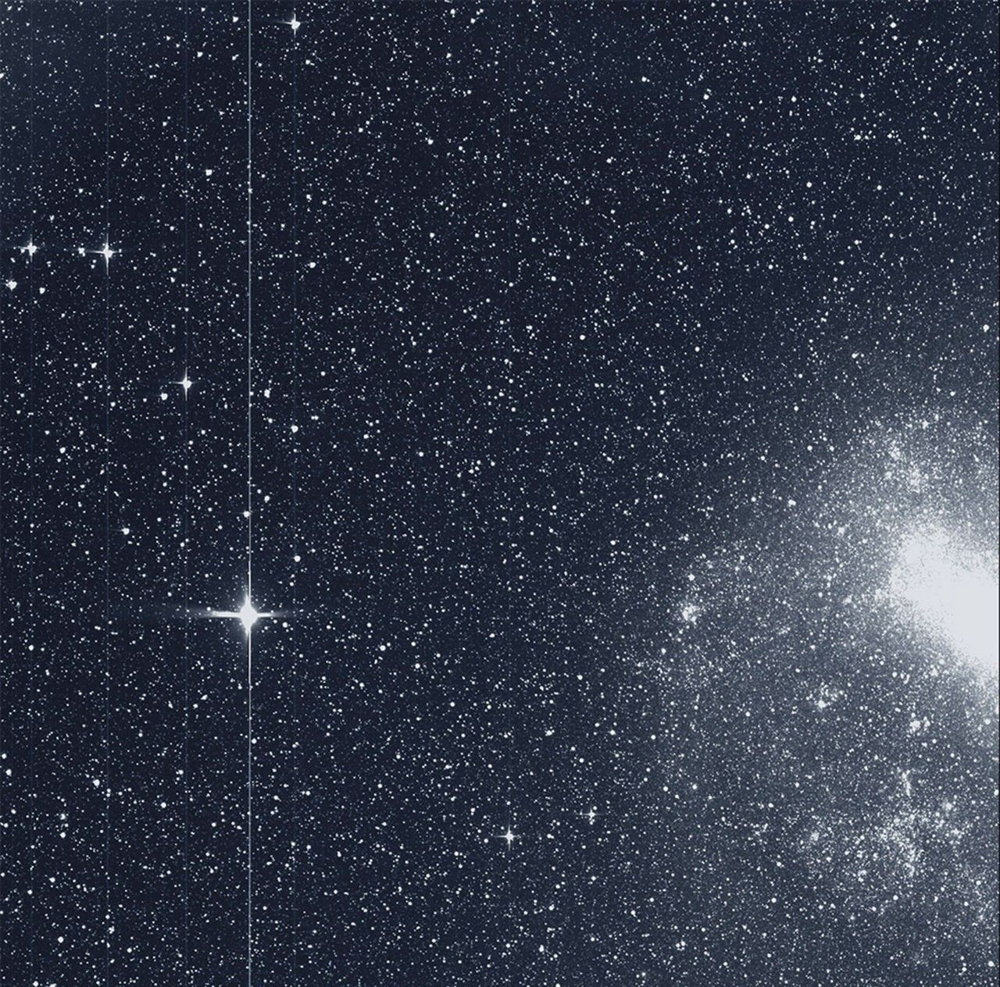

# Wormhole
## Exoplanet detection with flaxoil



This repository contains a Flaxoil model trainer capable of classifying exoplanets in the TESS Lightcurve dataset.

It has been designed with resource-constrained or edge-based environments in mind. It can be run on CPU-centric devices and has low memory requirements. It has been tested in a 4 CPU 8 GB Docker container on a single Apple Silicon MacBook Pro.

# What is TESS?

The [Transiting Exoplanet Survey Satellite](https://en.wikipedia.org/wiki/Transiting_Exoplanet_Survey_Satellite) was launched on 18 April 2018 on an MIT-Led NASA all-sky survey mission to detect transiting exoplanets.

Data from the mission is hosted at [MAST](https://archive.stsci.edu/missions-and-data/tess).

Photometric data products include time-series of full-frame CCD sensor images, time-series of selected pixels around target stars taken at faster cadences, and flux time-series generated from aperture photometry on these target pixels. MAST also hosts Planet Search data products such as statistics on detected threshold crossing events.

This project uses data products from the Primary Mission (Year 1 and 2), specifically:

- Light Curve (LC) data consisting of the flux time-series, and
- Threshold Crossing Event (TCE) data to generate classification labels for training.

# What is Flaxoil?

[Flaxoil](https://github.com/MNahad/flaxoil) is a port of the [ncps](https://github.com/mlech26l/keras-ncp) Python package, which itself is an implementation of Liquid Neural Networks [1] [2] developed at MIT.

A Liquid Neural Network is a novel ML algorithm that is bio-inspired by the brain of the _C. Elegans_ nematode. The network contains sparsely-connected RNN-based ODE solver cells, mimicing the roundworm's neural synapses.

Flaxoil ports the original ncps package to the Google Flax ML framework.

# Setup

## Installation

```sh
# Warning: Make sure this is run inside a virtual environment
pip install --user -U git+https://github.com/mnahad/wormhole.git@main # or @{tag}
```

## Project structure

When run, the data and models will be structured as follows:

```txt
data/
# Data catalogue for raw and transformed data products
|__ bronze/
    |__ ... # LC bulk information and TCE statistics fetched from HTTP endpoints
|__ silver/
    |__ ... # Transformed LCs and processed metadata
|__ gold/
    |__ ... # Joined datasets and processed pixel products ready for training jobs

checkpoints/
# Model checkpoint storage
|__ {id}/ # The training job ID
    |__ checkpoint/
        |__ {step}/ # The step ID
            |__ ...
    |__ constants/
        |__ 0 # Constants are only stored on initial step
            |__ ...
```

# API

## Data Preprocessing

```txt
$ wormhole pipeline -h
usage: wormhole pipeline [-h] [--only NAME | --all] run

positional arguments:
  run          run the pipeline

options:
  -h, --help   show this help message and exit
  --only NAME  only run a single stage by name
  --all, -a    run all stages
```

When executing the `run` subcommand, pass the `--all` flag if all preprocessing stages need to be run in series.

Otherwise pass one of the following using the `--only` flag (advanced usage):

| Stage Name | Purpose |
| :--- | :--- |
| `fetch_bulk_data` | Fetch LC and TCE information over HTTP |
| `process_metadataset` | Generate metadata on LCs and TCEs |
| `join_datasets` | Join metadata to generate Year 1+2 dataset |
| `generate_lightcurve_manifest` | Generate manifest for locally-stored LCs |
| `recache_lightcurve_store` | Fetch LCs from HTTP endpoint as per manifest |
| `process_lightcurves` | Preprocess LCs into final form |

## Model Training and Evaluation

```
$ wormhole training -h
usage: wormhole training [-h] {train,evaluate} ...

positional arguments:
  {train,evaluate}  training commands
    train           start or resume a training job
    evaluate        evaluate the model of a training job

options:
  -h, --help        show this help message and exit
```

### Training

To start a training job, pass the `train` subcommand. A user-specified ID can be assigned by passing the `--id` flag. If not, then an ID using the current datetime is auto-generated.

Models are auto-checkpointed in the dedicated checkpoint directory.

### Training Outputs

The CLI outputs a running log of loss metrics.

Wormhole first outputs the following CSV header to stdout:

```txt
STEP,LOSS
```

followed by a stream of CSV lines, one per step. Example:

```txt
10,0.6931472
```

### Evaluation

Once a training job is complete, the `evaluate` subcommand can be used to evaluate a model. Pass the `--eval-id` flag to select an existing training job ID.

### Evaluation outputs

The CLI outputs a running log of evaluation metrics.

Wormhole first outputs the following CSV header to stdout:

```txt
STEP,TRUE_POSITIVE,TRUE_NEGATIVE,FALSE_POSITIVE,FALSE_NEGATIVE,ACCURACY,PRECISION,RECALL,FALSEALARM
```

followed by a stream of CSV lines, one per step. Example:

```txt
80,2656,3422,559,1363,0.7597500085830688,0.8261275291442871,0.6608608961105347,0.1404169797897339
```

This is an example of a model with 11 LTC cell units trained on a 50% training split from 40,000 evenly-labelled samples, and an Adam learning rate of 0.01, with a batch size of 1, for 2 epochs. It was evaluated on a 20% test split and had an accuracy of 76.0%, a high precision of 82.6%, a low recall of 66.1%, and a very low false alarm rate of 14.0%.

# Configuration options

Wormhole can be configured by adding a `wormhole.toml` file either:

- in the root of the project, or
- by passing its path using the `WORMHOLE_CONFIG` environment variable.

## wormhole.toml

```toml
[urls.bulk]
host = "archive.stsci.edu" # The bulk endpoint host

[async]
batch_size = 100 # The default size when downloading LCs asynchronously

[data.catalogue]
path = ["data"] # Default data directory

# The following options are for configuring internal subfolders. Advanced usage only.
[data.catalogue.bronze]
path = ["bronze"]
[data.catalogue.silver]
path = ["silver"]
[data.catalogue.gold]
path = ["gold"]
[data.catalogue.lc]
path = ["lc", "curves"]
[data.catalogue.bulk_lc]
path = ["bulk", "pixel_products", "lc"]
[data.catalogue.bulk_tce]
path = ["bulk", "catalogs", "tce"]
[data.catalogue.lc_metadata]
path = ["lc", "meta"]
[data.catalogue.tce_metadata]
path = ["tce", "meta"]
[data.catalogue.metadataset]
path = ["lc", "metadataset"]
[data.catalogue.lc_manifest]
path = ["lc", "manifest"]

[pipelines.args]
debug = false # Print debug messages during data preprocessing
tce_sample_ratio = [20000, 20000] # How many TCE Positive- and Negative-labelled LCs to sample during fetch into local storage

[training]
batch_size = 10 # Batch size of LC batches
num_epochs = 10 # Number of epochs to cycle over when loading data for training or evaluation
active_model = "basic" # The active model to select (currently only a basic RNN Classifier consisting of a single LTC layer fed into a Dense layer)

[training.splits] # Ratios for splitting datasets
train = 0.5
validation = 0.3
test = 0.2

[training.allowed_labels_by_split] # Which labels should be filtered in when loading the given split (true: TCE, false: No TCE)
train = [true, false]
validation = [true, false]
test = [true, false]

[training.hyperparameters]
adam = 0.01 # The Adam learning rate

[training.hyperparameters.models.basic]
# Hyperparameters for the provided basic model
units = 11 # The number of LTC cells

[checkpoints]
path = ["checkpoints"] # Default checkpoint directory
save_interval_steps = 100 # The number of steps between saves
```

# Acknowledgements

- Funding for the TESS mission is provided by NASA's Science Mission directorate. This research includes data collected by the TESS mission, which are publicly available from the Mikulski Archive for Space Telescopes (MAST).
- Images courtesy of NASA/MIT/TESS.

# References
1. M. Lechner, R. Hasani, A. Amini, T. A. Henzinger, D. Rus, and R. Grosu, "Neural circuit policies enabling auditable autonomy," Nature Machine Intelligence, vol. 2, no. 10, pp. 642-652, Oct 2020.
1. R. Hasani, M. Lechner, A. Amini, D. Rus, and R. Grosu, "Liquid Time-constant Networks", AAAI, vol. 35, no. 9, pp. 7657-7666, May 2021.